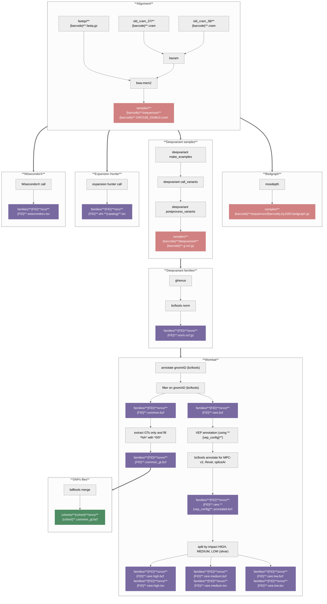

# Graph of the nextflow

```mermaid
---

displayMode: compact
config:
    theme: neutral
---

flowchart TB
    subgraph alignment [**Alignment**]
        direction TB
        subgraph alignmentinput[ ]
            alignment_fastq["fastqs/**{barcode}**.fastq.gz"]
            alignment_37["old_cram_37/**{barcode}**.cram"]
            alignment_38["old_cram_38/**{barcode}**.cram"]
        end

        alignment_bazam["bazam"]

        alignment_bwa["bwa-mem2"]

        alignment_cram["samples/**{barcode}**/sequences/**{barcode}**.GRCh38_GIABv3.cram"]:::os

        alignment_fastq --> alignment_bwa
        alignment_37 --> alignment_bazam
        alignment_38 --> alignment_bazam
        alignment_bazam --> alignment_bwa --> alignment_cram
    end

    subgraph bedgraph [**Bedgraph**]
        direction TB
        bedgraph_mosdepth["mosdepth"]
        bedgraph_bedgraph["samples/**{barcode}**/sequences/{barcode}.by1000.bedgraph.gz"]:::os
        %% alignment_cram ==> bedgraph_mosdepth
        bedgraph_mosdepth --> bedgraph_bedgraph
    end

    subgraph deepvariant [**Deepvariant samples**]
        direction TB
        dv_me["deepvariant make_examples"]
        dv_cv["deepvariant call_variants"]
        dv_pp["deepvariant postprocess_variants"]
        dv_vcf["samples/**{barcode}**/deepvariant/**{barcode}**.g.vcf.gz"]:::os
        dv_me --> dv_cv --> dv_pp --> dv_vcf

    end

    subgraph glnexus [**Deepvariant families**]
        direction TB
        glnexus_glnexus["glnexus"]
        glnexus_norm["bcftools norm"]
        glnexus_vcf["families/**{FID}**/snvs/**{FID}**.norm.vcf.gz"]:::of
        glnexus_glnexus --> glnexus_norm --> glnexus_vcf
    end

    subgraph wombat [**Wombat**]
        direction TB
        wombat_a_gnomad["annotate gnomAD (bcftools)"]
        wombat_f_gnomad["filter on gnomAD (bcftools)"]
        wombat_common_vcf["families/**{FID}**/snvs/**{FID}**.common.bcf"]:::of
        wombat_common_ex["extract GTs only and fill *NA* with *0/0*"]
        wombat_common_gt["families/**{FID}**/snvs/**{FID}**.common_gt.bcf"]:::of
        wombat_rare_vcf["families/**{FID}**/snvs/**{FID}**.rare.bcf"]:::of
        wombat_rare_vep["VEP annotation (using **{vep_config}**)"]
        wombat_rare_annot["bcftools annotate for MPC-v2, Revel, spliceAI"]
        wombat_rare_file["families/**{FID}**/snvs/**{FID}**.rare.**{vep_config}**.annotated.bcf"]:::of
        wombat_rare_split["split by impact HIGH, MEDIUM, LOW (slivar)"]

        wombat_rare_high["families/**{FID}**/snvs/**{FID}**.rare.high.bcf families/**{FID}**/snvs/**{FID}**.rare.high.tsv"]:::of
        wombat_rare_medium["families/**{FID}**/snvs/**{FID}**.rare.medium.bcf families/**{FID}**/snvs/**{FID}**.rare.medium.tsv"]:::of
        wombat_rare_low["families/**{FID}**/snvs/**{FID}**.rare.low.bcf families/**{FID}**/snvs/**{FID}**.rare.low.tsv"]:::of

        wombat_a_gnomad --> wombat_f_gnomad
        wombat_f_gnomad --> wombat_common_vcf --> wombat_common_ex --> wombat_common_gt
        wombat_f_gnomad --> wombat_rare_vcf --> wombat_rare_vep --> wombat_rare_annot --> wombat_rare_file --> wombat_rare_split
        wombat_rare_split --> wombat_rare_high
        wombat_rare_split --> wombat_rare_medium
        wombat_rare_split --> wombat_rare_low
    end

    subgraph snps [**SNPs files**]
        direction TB
        snps_merge["bdftools merge"]
        snps_bcf["cohorts/**{cohort}**/snvs/**{cohort}**.common_gt.bcf"]:::oc
        snps_merge --> snps_bcf
    end

    subgraph expansionhunter [**Expansion Hunter**]
        direction TB
        ehr_call["expansion hunter call"]
        ehr_file["families/**{FID}**/strs/**{FID}**.ehr.**{catalog}**.tsv"]:::of
        ehr_call --> ehr_file
    end

    subgraph wisecondorx [**WisecondorX**]
        direction TB
        wcx_call["WisecondorX call"]
        wcx_file["families/**{FID}**/svs/**{FID}**.wisecondorx.tsv"]:::of
        wcx_call --> wcx_file
    end

    alignment ==> bedgraph
    alignment ==> expansionhunter
    alignment ==> wisecondorx
    alignment ==> deepvariant
    deepvariant ==> glnexus
    glnexus ==> wombat
    wombat_common_gt ==> snps

    classDef os fill: #d18181ff, stroke-width: 0px, font-size: 12pt, color: #fff ;
    classDef of fill: #7869a1ff, stroke-width: 0px, font-size: 12pt, color: #fff ;
    classDef oc fill: #4e8c63ff, stroke-width: 0px, font-size: 12pt, color: #fff ;

    %% style snps fill: #ddbdf7ff ;
    style alignmentinput stroke-width: 0 ;
```
