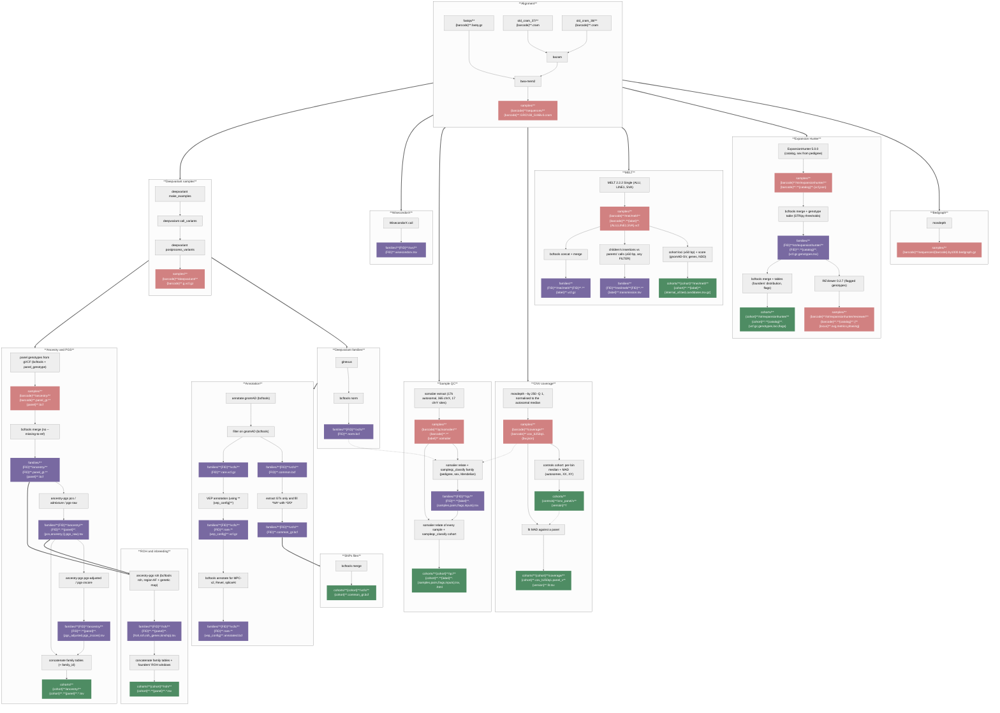

# Graph of the nextflow

```mermaid
---

displayMode: compact
config:
    theme: neutral
---

flowchart TB
    subgraph alignment [**Alignment**]
        direction TB
        subgraph alignmentinput[ ]
            alignment_fastq["fastqs/**{barcode}**.fastq.gz"]
            alignment_37["old_cram_37/**{barcode}**.cram"]
            alignment_38["old_cram_38/**{barcode}**.cram"]
        end

        alignment_bazam["bazam"]

        alignment_bwa["bwa-mem2"]

        alignment_cram["samples/**{barcode}**/sequences/**{barcode}**.GRCh38_GIABv3.cram"]:::os

        alignment_fastq --> alignment_bwa
        alignment_37 --> alignment_bazam
        alignment_38 --> alignment_bazam
        alignment_bazam --> alignment_bwa --> alignment_cram
    end

    subgraph bedgraph [**Bedgraph**]
        direction TB
        bedgraph_mosdepth["mosdepth"]
        bedgraph_bedgraph["samples/**{barcode}**/sequences/{barcode}.by1000.bedgraph.gz"]:::os
        %% alignment_cram ==> bedgraph_mosdepth
        bedgraph_mosdepth --> bedgraph_bedgraph
    end

    subgraph deepvariant [**Deepvariant samples**]
        direction TB
        dv_me["deepvariant make_examples"]
        dv_cv["deepvariant call_variants"]
        dv_pp["deepvariant postprocess_variants"]
        dv_vcf["samples/**{barcode}**/deepvariant/**{barcode}**.g.vcf.gz"]:::os
        dv_me --> dv_cv --> dv_pp --> dv_vcf

    end

    subgraph glnexus [**Deepvariant families**]
        direction TB
        glnexus_glnexus["glnexus"]
        glnexus_norm["bcftools norm"]
        glnexus_vcf["families/**{FID}**/vcfs/**{FID}**.norm.bcf"]:::of
        glnexus_glnexus --> glnexus_norm --> glnexus_vcf
    end

    subgraph annotation [**Annotation**]
        direction TB
        annotation_a_gnomad["annotate gnomAD (bcftools)"]
        annotation_f_gnomad["filter on gnomAD (bcftools)"]
        annotation_common_vcf["families/**{FID}**/vcfs/**{FID}**.common.bcf"]:::of
        annotation_common_ex["extract GTs only and fill *NA* with *0/0*"]
        annotation_common_gt["families/**{FID}**/vcfs/**{FID}**.common_gt.bcf"]:::of
        annotation_rare_vcf["families/**{FID}**/vcfs/**{FID}**.rare.vcf.gz"]:::of
        annotation_rare_vep["VEP annotation (using **{vep_config}**)"]
        annotation_rare_vep_vcf["families/**{FID}**/vcfs/**{FID}**.rare.**{vep_config}**.vcf.gz"]:::of
        annotation_rare_annot["bcftools annotate for MPC-v2, Revel, spliceAI"]
        annotation_rare_file["families/**{FID}**/vcfs/**{FID}**.rare.**{vep_config}**.annotated.bcf"]:::of

        annotation_a_gnomad --> annotation_f_gnomad
        annotation_f_gnomad --> annotation_common_vcf --> annotation_common_ex --> annotation_common_gt
        annotation_f_gnomad --> annotation_rare_vcf --> annotation_rare_vep --> annotation_rare_vep_vcf --> annotation_rare_annot --> annotation_rare_file
    end

    subgraph snps [**SNPs files**]
        direction TB
        snps_merge["bcftools merge"]
        snps_bcf["cohorts/**{cohort}**/vcfs/**{cohort}**.common_gt.bcf"]:::oc
        snps_merge --> snps_bcf
    end

    subgraph ancestry [**Ancestry and PGS**]
        direction TB
        anc_extract["panel genotypes from gVCF (bcftools + panel_genotype)"]
        anc_sample["samples/**{barcode}**/ancestry/**{barcode}**.panel_gt.**{panel}**.bcf"]:::os
        anc_merge["bcftools merge (no --missing-to-ref)"]
        anc_family_bcf["families/**{FID}**/ancestry/**{FID}**.panel_gt.**{panel}**.bcf"]:::of
        anc_score["ancestry-pgs pcs / admixture / pgs-raw"]
        anc_apply["ancestry-pgs pgs-adjusted / pgs-zscore"]
        anc_family_tsv["families/**{FID}**/ancestry/**{FID}**.**{panel}**.{pcs,ancestry,Q,pgs_raw}.tsv"]:::of
        anc_family_z["families/**{FID}**/ancestry/**{FID}**.**{panel}**.{pgs_adjusted,pgs_zscore}.tsv"]:::of
        anc_concat["concatenate family tables (+ family_id)"]
        anc_cohort["cohorts/**{cohort}**/ancestry/**{cohort}**.**{panel}**.*.tsv"]:::oc

        anc_extract --> anc_sample --> anc_merge --> anc_family_bcf --> anc_score
        anc_score --> anc_family_tsv --> anc_apply --> anc_family_z
        anc_family_tsv --> anc_concat
        anc_family_z --> anc_concat
        anc_concat --> anc_cohort
    end

    subgraph roh [**ROH and inbreeding**]
        direction TB
        roh_call["ancestry-pgs roh (bcftools roh, region AF + genetic map)"]
        roh_family["families/**{FID}**/roh/**{FID}**.**{panel}**.{froh,roh,roh_genes,kinship}.tsv"]:::of
        roh_concat["concatenate family tables + founders' ROH windows"]
        roh_cohort["cohorts/**{cohort}**/roh/**{cohort}**.**{panel}**.*.tsv"]:::oc
        roh_call --> roh_family --> roh_concat --> roh_cohort
    end

    subgraph expansionhunter [**Expansion Hunter**]
        direction TB
        eh_call["ExpansionHunter 5.0.0 (catalog, sex from pedigree)"]
        eh_sample["samples/**{barcode}**/str/expansionhunter/**{barcode}**.**{catalog}**.{vcf,json}"]:::os
        eh_merge["bcftools merge + genotype table (STRipy thresholds)"]
        eh_family["families/**{FID}**/str/expansionhunter/**{FID}**.**{catalog}**.{vcf.gz,genotypes.tsv}"]:::of
        eh_concat["bcftools merge + tables (founders' distribution, flags)"]
        eh_cohort["cohorts/**{cohort}**/str/expansionhunter/**{cohort}**.**{catalog}**.{vcf.gz,genotypes,loci,flags}"]:::oc
        eh_reviewer["REViewer 0.2.7 (flagged genotypes)"]
        eh_pileups["samples/**{barcode}**/str/expansionhunter/reviewer/**{barcode}**.**{catalog}**.{**{locus}**.svg,metrics,phasing}"]:::os
        eh_call --> eh_sample --> eh_merge --> eh_family --> eh_concat --> eh_cohort
        eh_family --> eh_reviewer --> eh_pileups
    end

    subgraph melt [**MELT**]
        direction TB
        melt_call["MELT 2.2.2 Single (ALU, LINE1, SVA)"]
        melt_sample["samples/**{barcode}**/mei/melt/**{barcode}**.**{label}**.{ALU,LINE1,SVA}.vcf"]:::os
        melt_merge["bcftools concat + merge"]
        melt_family["families/**{FID}**/mei/melt/**{FID}**.**{label}**.vcf.gz"]:::of
        melt_trans["children's insertions vs parents' calls (±50 bp, any FILTER)"]
        melt_trans_out["families/**{FID}**/mei/melt/**{FID}**.**{label}**.transmission.tsv"]:::of
        melt_score["cohort loci (±50 bp) + score (gnomAD-SV, genes, NDD)"]
        melt_cohort["cohorts/**{cohort}**/mei/melt/**{cohort}**.**{label}**.{internal_af.bed,candidates.tsv.gz}"]:::oc
        melt_call --> melt_sample --> melt_merge --> melt_family
        melt_sample --> melt_trans --> melt_trans_out
        melt_sample --> melt_score --> melt_cohort
    end

    subgraph cnvcoverage [**CNV coverage**]
        direction TB
        cnv_mosdepth["mosdepth --by 250 -Q 1, normalised to the autosomal median"]
        cnv_sample["samples/**{barcode}**/coverage/**{barcode}**.cov_b250q1.{bw,json}"]:::os
        cnv_panel["controls cohort: per-bin median + MAD (autosomes, XX, XY)"]
        cnv_panel_out["cohorts/**{controls}**/cnv_panel/v**{version}**/"]:::oc
        cnv_fit["fit MAD against a panel"]
        cnv_fit_out["cohorts/**{cohort}**/coverage/**{cohort}**.cov_b250q1.panel_v**{version}**.fit.tsv"]:::oc
        cnv_mosdepth --> cnv_sample --> cnv_panel --> cnv_panel_out
        cnv_sample --> cnv_fit --> cnv_fit_out
        cnv_panel_out -.-> cnv_fit
    end

    subgraph sampleqc [**Sample QC**]
        direction TB
        sqc_extract["somalier extract (17k autosomal, 365 chrX, 17 chrY sites)"]
        sqc_sample["samples/**{barcode}**/qc/somalier/**{barcode}**.**{label}**.somalier"]:::os
        sqc_family_relate["somalier relate + sampleqc_classify family (pedigree, sex, Mendelian)"]
        sqc_family["families/**{FID}**/qc/**{FID}**.**{label}**.{samples,pairs,flags,inputs}.tsv"]:::of
        sqc_cohort_relate["somalier relate of every sample + sampleqc_classify cohort"]
        sqc_cohort["cohorts/**{cohort}**/qc/**{cohort}**.**{label}**.{samples,pairs,flags,inputs}.tsv, .html"]:::oc
        sqc_extract --> sqc_sample --> sqc_family_relate --> sqc_family --> sqc_cohort_relate --> sqc_cohort
        sqc_sample --> sqc_cohort_relate
    end

    subgraph wisecondorx [**WisecondorX**]
        direction TB
        wcx_call["WisecondorX call"]
        wcx_file["families/**{FID}**/svs/**{FID}**.wisecondorx.tsv"]:::of
        wcx_call --> wcx_file
    end

    alignment ==> bedgraph
    alignment ==> expansionhunter
    alignment ==> melt
    alignment ==> cnvcoverage
    alignment ==> sampleqc
    cnv_sample -.-> sqc_family_relate
    glnexus_vcf -.-> sqc_family_relate
    alignment ==> wisecondorx
    alignment ==> deepvariant
    deepvariant ==> glnexus
    deepvariant ==> ancestry
    anc_family_bcf ==> roh_call
    anc_family_tsv ==> roh_call
    glnexus ==> annotation
    annotation_common_gt ==> snps

    classDef os fill: #d18181ff, stroke-width: 0px, font-size: 12pt, color: #fff ;
    classDef of fill: #7869a1ff, stroke-width: 0px, font-size: 12pt, color: #fff ;
    classDef oc fill: #4e8c63ff, stroke-width: 0px, font-size: 12pt, color: #fff ;

    %% style snps fill: #ddbdf7ff ;
    style alignmentinput stroke-width: 0 ;
```
